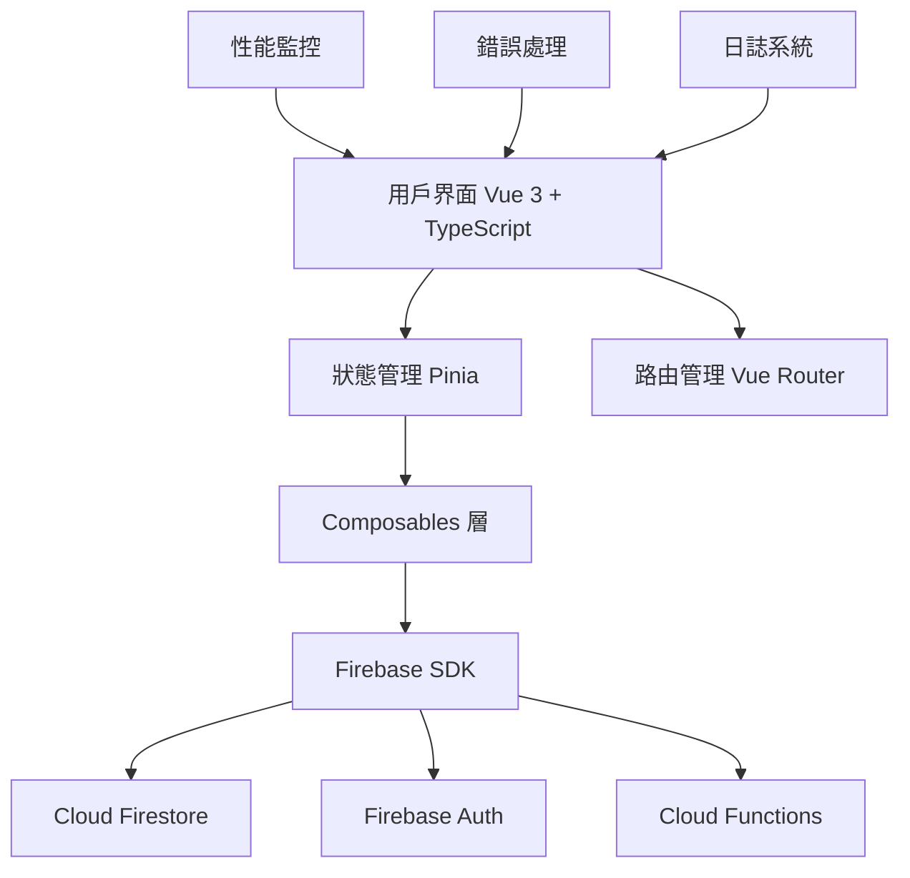

# 🏔️ 台灣登山知識庫 (Hiking Wiki Taiwan)

> **一個專為台灣登山愛好者打造的協作知識分享平台，提供文章投稿、分類瀏覽、專家審核及社群互動功能。**

[](https://vuejs.org/)
[](https://www.typescriptlang.org/)
[](https://firebase.google.com/)
[](https://vitejs.dev/)
[](LICENSE)

---

## 📌 專案簡介

台灣登山知識庫是一個現代化的 Web 應用程式，旨在建立一個完整的登山知識共享生態系統。平台支援用戶投稿登山相關文章、專家審核機制、分類瀏覽、即時通知系統，以及完善的管理員後台，讓登山愛好者能夠輕鬆分享經驗與獲取實用資訊。

### ✨ 核心功能

- 🔐 **Google OAuth 認證系統** - 安全便捷的用戶登入機制
- 📝 **Markdown 編輯器** - 支援即時預覽的文章投稿系統
- 👑 **專家審核機制** - 確保內容品質的多級審核流程
- 🏷️ **智能分類系統** - 登山路線、裝備心得、安全知識等分類管理
- 🔍 **全文搜尋功能** - 快速找到所需的登山資訊
- 📬 **即時通知系統** - 文章狀態更新、系統消息推送
- 📱 **響應式設計** - 完美支援桌面端與移動端設備
- ⚡ **高性能架構** - 內建緩存、代碼分割、性能監控

---

## 🧱 架構總覽

### 技術棧

#### 前端框架
- **Vue 3** - 漸進式 JavaScript 框架，提供組合式 API
- **TypeScript** - 類型安全的 JavaScript 超集
- **Vite** - 下一代前端構建工具，提供極速的開發體驗
- **Vue Router** - 官方路由管理器
- **Pinia** - 現代化的狀態管理庫

#### UI 與樣式
- **Tailwind CSS** - 實用優先的 CSS 框架
- **Vue Quill** - 富文本編輯器組件
- **Marked** - Markdown 解析器

#### 後端服務
- **Firebase Authentication** - 用戶認證與授權
- **Cloud Firestore** - NoSQL 文檔數據庫
- **Cloud Functions** - 無服務器後端邏輯
- **Firebase Hosting** - 靜態網站託管

#### 開發工具
- **ESLint** - 代碼品質檢查
- **Terser** - JavaScript 壓縮工具
- **PostCSS** - CSS 後處理器

### 系統架構



---

## 🚀 安裝與啟動步驟

### 環境要求

- **Node.js** >= 18.0.0
- **npm** >= 9.0.0 或 **yarn** >= 1.22.0
- **Git** 版本控制工具

### 快速開始

#### 1. 克隆項目

```bash
# 使用 HTTPS
git clone https://github.com/your-username/hiking-wiki.git

# 或使用 SSH
git clone git@github.com:your-username/hiking-wiki.git

cd hiking-wiki
```

#### 2. 安裝依賴

```bash
# 使用 npm
npm install

# 或使用 yarn
yarn install
```

#### 3. 環境配置

```bash
# 複製環境變數模板
cp .env.example .env.local

# 編輯環境變數文件
nano .env.local
```

#### 4. Firebase 配置

1. 前往 [Firebase Console](https://console.firebase.google.com/)
2. 創建新項目或使用現有項目
3. 啟用以下服務：
   - Authentication (Google 登入)
   - Cloud Firestore
   - Cloud Functions
   - Hosting
4. 將配置資訊填入 `.env.local`

#### 5. 啟動開發服務器

```bash
# 開發模式
npm run dev

# 或
yarn dev
```

應用將在 `http://localhost:3000` 啟動

#### 6. 建置生產版本

```bash
# 建置
npm run build

# 預覽建置結果
npm run preview
```

---

## ⚙️ 環境變數說明

### 必需環境變數

在 `.env.local` 文件中配置以下變數：

```bash
# Firebase 配置
VITE_FIREBASE_API_KEY=your_api_key_here
VITE_FIREBASE_AUTH_DOMAIN=your_project.firebaseapp.com
VITE_FIREBASE_PROJECT_ID=your_project_id
VITE_FIREBASE_STORAGE_BUCKET=your_project.appspot.com
VITE_FIREBASE_MESSAGING_SENDER_ID=123456789
VITE_FIREBASE_APP_ID=1:123456789:web:abcdefghijklmnop

# 應用配置
VITE_APP_NAME=台灣登山知識庫
VITE_APP_VERSION=1.0.0
VITE_APP_ENV=development

# 功能開關
VITE_ENABLE_DEBUG=true
VITE_ENABLE_PERFORMANCE_MONITORING=true
VITE_ENABLE_ERROR_REPORTING=true

# API 配置 (可選)
VITE_API_BASE_URL=https://your-api-domain.com
VITE_API_TIMEOUT=10000
```

### 環境變數說明

| 變數名稱 | 必需 | 說明 | 範例值 |
|---------|------|------|--------|
| `VITE_FIREBASE_API_KEY` | ✅ | Firebase API 金鑰 | `AIzaSyA...` |
| `VITE_FIREBASE_AUTH_DOMAIN` | ✅ | Firebase 認證域名 | `project.firebaseapp.com` |
| `VITE_FIREBASE_PROJECT_ID` | ✅ | Firebase 項目 ID | `hiking-wiki-taiwan` |
| `VITE_FIREBASE_STORAGE_BUCKET` | ✅ | Firebase 儲存桶 | `project.appspot.com` |
| `VITE_FIREBASE_MESSAGING_SENDER_ID` | ✅ | Firebase 消息發送者 ID | `123456789` |
| `VITE_FIREBASE_APP_ID` | ✅ | Firebase 應用 ID | `1:123:web:abc123` |
| `VITE_APP_NAME` | ❌ | 應用名稱 | `台灣登山知識庫` |
| `VITE_ENABLE_DEBUG` | ❌ | 啟用調試模式 | `true` / `false` |

---

## 🧪 測試方式

### 單元測試

```bash
# 運行所有單元測試
npm run test

# 監聽模式運行測試
npm run test:watch

# 生成測試覆蓋率報告
npm run test:coverage
```

### 端到端測試

```bash
# 運行 E2E 測試
npm run test:e2e

# 在 CI 環境運行測試
npm run test:e2e:ci
```

### 代碼品質檢查

```bash
# ESLint 檢查
npm run lint

# 自動修復可修復的問題
npm run lint:fix

# TypeScript 類型檢查
npm run type-check
```

### 測試工具

- **Vitest** - 單元測試框架
- **Vue Test Utils** - Vue 組件測試工具
- **Cypress** - 端到端測試框架
- **MSW** - API 模擬工具

---

## 📁 目錄結構總覽

```
hiking-wiki/
├── 📁 public/                    # 靜態資源
│   ├── favicon.ico
│   └── manifest.json
├── 📁 src/                       # 源代碼目錄
│   ├── 📁 assets/                # 資源文件
│   │   ├── index.css             # 主樣式文件
│   │   ├── wiki-theme.css        # 主題樣式
│   │   └── globals.css           # 全域樣式
│   ├── 📁 components/            # Vue 組件
│   │   ├── 📁 admin/             # 管理員組件
│   │   ├── 📁 articles/          # 文章相關組件
│   │   ├── 📁 auth/              # 認證組件
│   │   ├── 📁 common/            # 通用組件
│   │   └── 📁 layout/            # 佈局組件
│   ├── 📁 composables/           # 組合式 API
│   │   ├── useAuth.ts            # 認證邏輯
│   │   ├── useArticles.ts        # 文章管理
│   │   └── useValidation.ts      # 表單驗證
│   ├── 📁 config/                # 配置文件
│   │   └── environment.ts        # 環境配置
│   ├── 📁 firebase/              # Firebase 配置
│   │   ├── index.ts              # Firebase 初始化
│   │   ├── authUtils.ts          # 認證工具
│   │   └── functions.ts          # Cloud Functions
│   ├── 📁 store/                 # Pinia 狀態管理
│   │   ├── admin.ts              # 管理員狀態
│   │   └── notifications.ts     # 通知狀態
│   ├── 📁 types/                 # TypeScript 類型定義
│   │   └── index.ts              # 主要類型定義
│   ├── 📁 utils/                 # 工具函數
│   │   ├── logger.ts             # 日誌系統
│   │   ├── errorHandler.ts       # 錯誤處理
│   │   ├── performance.ts        # 性能監控
│   │   ├── formatters.ts         # 格式化工具
│   │   └── htmlMarkdownConverter.ts # 內容轉換
│   ├── 📁 views/                 # 頁面組件
│   │   ├── Home.vue              # 首頁
│   │   ├── About.vue             # 關於頁面
│   │   ├── Login.vue             # 登入頁面
│   │   ├── Knowledge.vue         # 知識庫頁面
│   │   ├── ArticleDetail.vue     # 文章詳情
│   │   ├── Category.vue          # 分類頁面
│   │   ├── MyArticles.vue        # 我的文章
│   │   ├── Notifications.vue     # 通知中心
│   │   ├── SubmitArticlePage.vue # 投稿頁面
│   │   ├── Review.vue            # 審核頁面
│   │   ├── AdminPanel.vue        # 管理面板
│   │   └── NotFound.vue          # 404 頁面
│   ├── App.vue                   # 主應用組件
│   └── main.ts                   # 應用入口點
├── 📁 functions/                 # Cloud Functions
│   ├── 📁 src/                   # Functions 源代碼
│   └── package.json              # Functions 依賴
├── 📁 tests/                     # 測試文件
│   ├── 📁 unit/                  # 單元測試
│   └── 📁 e2e/                   # 端到端測試
├── 📁 docs/                      # 項目文檔
├── .env.example                  # 環境變數範例
├── .gitignore                    # Git 忽略文件
├── firebase.json                 # Firebase 配置
├── firestore.rules              # Firestore 安全規則
├── firestore.indexes.json       # Firestore 索引配置
├── package.json                  # 項目依賴與腳本
├── tsconfig.json                 # TypeScript 配置
├── vite.config.ts               # Vite 配置
└── README.md                     # 項目說明文檔
```

---

## 📄 API 文件

### Cloud Functions 端點

#### 認證相關

```bash
# 授予管理員權限
POST /grantAdminRole
Content-Type: application/json
Authorization: Bearer <firebase-token>

{
  "uid": "user_uid_here"
}
```

```bash
# 撤銷管理員權限
POST /revokeAdminRole
Content-Type: application/json
Authorization: Bearer <firebase-token>

{
  "uid": "user_uid_here"
}
```

#### 通知相關

```bash
# 發送審核通知
POST /sendReviewNotification
Content-Type: application/json
Authorization: Bearer <firebase-token>

{
  "articleId": "article_id_here",
  "status": "approved",
  "reviewComment": "審核意見"
}
```

### Firestore 集合結構

#### `articles` 集合

```typescript
interface Article {
  id: string                    // 文章 ID
  title: string                 // 標題
  content: string               // Markdown 內容
  category: string              // 分類
  uid: string                   // 作者 UID
  displayName: string           // 作者名稱
  status: 'pending' | 'approved' | 'rejected'  // 狀態
  isFeatured?: boolean          // 是否精選
  createdAt: Timestamp          // 創建時間
  updatedAt?: Timestamp         // 更新時間
  images?: string[]             // 圖片 URL 陣列
}
```

#### `users` 集合

```typescript
interface UserProfile {
  id: string                    // 用戶 UID
  displayName?: string          // 顯示名稱
  email?: string                // 電子郵件
  photoURL?: string             // 頭像 URL
  isAdmin?: boolean             // 是否為管理員
}
```

#### `notifications` 集合

```typescript
interface NotificationMessage {
  id: string                    // 通知 ID
  uid: string                   // 接收者 UID
  message: string               // 通知內容
  type: string                  // 通知類型
  read: boolean                 // 是否已讀
  createdAt: Timestamp          // 創建時間
  articleId?: string            // 相關文章 ID
}
```

### 使用範例

詳細的 API 使用範例和互動式文檔請參考：
- **Firestore 安全規則**: [`firestore.rules`](firestore.rules)
- **索引配置**: [`firestore.indexes.json`](firestore.indexes.json)
- **Postman 集合**: [`docs/api-collection.json`](docs/api-collection.json)

---

## 👨‍💻 貢獻指南

我們歡迎並感謝任何形式的貢獻！請遵循以下指南來確保專案的一致性和品質。

### 🔧 開發設置

1. **Fork 專案** 並克隆到本地
2. **創建功能分支**: `git checkout -b feature/amazing-feature`
3. **安裝依賴**: `npm install`
4. **啟動開發服務器**: `npm run dev`

### 📝 代碼規範

#### Commit Message 格式

我們使用 [Conventional Commits](https://www.conventionalcommits.org/) 規範：

```
<type>[optional scope]: <description>

[optional body]

[optional footer(s)]
```

**類型 (Type):**
- `feat`: 新功能
- `fix`: 錯誤修復
- `docs`: 文檔更新
- `style`: 代碼格式調整
- `refactor`: 代碼重構
- `test`: 測試相關
- `chore`: 建置工具或輔助工具的變動

**範例:**
```bash
feat(auth): 新增 Google OAuth 登入功能

新增了 Google OAuth 認證流程，包含：
- 登入/登出功能
- 用戶資料同步
- 認證狀態管理

Closes #123
```

#### TypeScript 規範

- 使用 **嚴格模式** TypeScript 配置
- 所有函數必須有明確的 **返回類型**
- 使用 **interface** 定義數據結構
- 避免使用 `any` 類型

```typescript
// ✅ 正確示例
interface Article {
  id: string
  title: string
  content: string
}

const fetchArticle = async (id: string): Promise<Article | null> => {
  // 實現邏輯
}

// ❌ 錯誤示例
const fetchArticle = async (id: any): Promise<any> => {
  // 實現邏輯
}
```

#### Vue 組件規範

- 使用 **Composition API** 和 `<script setup>`
- 組件名稱使用 **PascalCase**
- Props 必須定義 **類型**
- 使用 **單文件組件** (SFC) 格式

```vue
<!-- ✅ 正確示例 -->
<script setup lang="ts">
interface Props {
  title: string
  count?: number
}

const props = withDefaults(defineProps<Props>(), {
  count: 0
})

const emit = defineEmits<{
  update: [value: string]
}>()
</script>
```

### 🧪 測試要求

- **新功能** 必須包含對應的單元測試
- **重要功能** 需要端到端測試
- 測試覆蓋率應保持在 **80%** 以上
- 所有測試必須通過才能合併

```bash
# 運行測試
npm run test

# 檢查覆蓋率
npm run test:coverage
```

### 📋 Pull Request 流程

1. **確保所有測試通過**
2. **更新相關文檔**
3. **填寫 PR 模板**
4. **請求 Code Review**
5. **解決 Review 意見**
6. **等待維護者合併**

#### PR 模板

```markdown
## 📝 變更說明
簡要描述這次 PR 的主要變更

## 🔧 變更類型
- [ ] 新功能 (feature)
- [ ] 錯誤修復 (bugfix)
- [ ] 重構 (refactor)
- [ ] 文檔更新 (docs)
- [ ] 測試 (test)

## ✅ 檢查清單
- [ ] 代碼遵循專案規範
- [ ] 已添加對應測試
- [ ] 所有測試通過
- [ ] 已更新相關文檔
- [ ] 已自測功能正常

## 📸 截圖 (如適用)
[添加相關截圖]

## 🔗 相關 Issue
Closes #[issue number]
```

### 👥 貢獻者行為準則

我們承諾為每個人提供友善、安全和歡迎的環境。請遵循以下準則：

- 使用包容性語言
- 尊重不同觀點和經驗
- 優雅地接受建設性批評
- 專注於對社群最有利的事情
- 對其他貢獻者表現同理心

---

## 📜 授權與版權資訊

### 開源許可證

本專案採用 **MIT License** 授權 - 詳見 [LICENSE](LICENSE) 文件。

```
MIT License

Copyright (c) 2025 台灣登山知識庫團隊

Permission is hereby granted, free of charge, to any person obtaining a copy
of this software and associated documentation files (the "Software"), to deal
in the Software without restriction, including without limitation the rights
to use, copy, modify, merge, publish, distribute, sublicense, and/or sell
copies of the Software, and to permit persons to whom the Software is
furnished to do so, subject to the following conditions:

The above copyright notice and this permission notice shall be included in all
copies or substantial portions of the Software.

THE SOFTWARE IS PROVIDED "AS IS", WITHOUT WARRANTY OF ANY KIND, EXPRESS OR
IMPLIED, INCLUDING BUT NOT LIMITED TO THE WARRANTIES OF MERCHANTABILITY,
FITNESS FOR A PARTICULAR PURPOSE AND NONINFRINGEMENT. IN NO EVENT SHALL THE
AUTHORS OR COPYRIGHT HOLDERS BE LIABLE FOR ANY CLAIM, DAMAGES OR OTHER
LIABILITY, WHETHER IN AN ACTION OF CONTRACT, TORT OR OTHERWISE, ARISING FROM,
OUT OF OR IN CONNECTION WITH THE SOFTWARE OR THE USE OR OTHER DEALINGS IN THE
SOFTWARE.
```

### 第三方依賴

本專案使用了以下開源軟體，我們對這些專案的貢獻者致以謝意：

- **Vue.js** - [MIT License](https://github.com/vuejs/vue/blob/dev/LICENSE)
- **Firebase** - [Apache License 2.0](https://github.com/firebase/firebase-js-sdk/blob/master/LICENSE)
- **Tailwind CSS** - [MIT License](https://github.com/tailwindlabs/tailwindcss/blob/master/LICENSE)
- **Vite** - [MIT License](https://github.com/vitejs/vite/blob/main/LICENSE)

### 商標與版權

- **台灣登山知識庫** 名稱和標識為本專案原創
- 用戶上傳的內容版權歸原作者所有
- 平台代碼採用 MIT License 開源

### 聯絡資訊

- **專案維護者**: [Your Name](mailto:your.email@example.com)
- **Issue 回報**: [GitHub Issues](https://github.com/your-username/hiking-wiki/issues)
- **功能建議**: [GitHub Discussions](https://github.com/your-username/hiking-wiki/discussions)
- **安全漏洞回報**: [security@hiking-wiki.tw](mailto:security@hiking-wiki.tw)

---

## 🙏 致謝

感謝所有為這個專案貢獻代碼、文檔、測試和想法的貢獻者！

特別感謝：
- 台灣登山社群的意見回饋
- 開源社群提供的優秀工具和庫
- Beta 測試用戶的寶貴建議

---

<div align="center">

**🏔️ 讓我們一起建設更好的登山知識分享平台！**

[⭐ Star](https://github.com/your-username/hiking-wiki) · [🐛 Report Bug](https://github.com/your-username/hiking-wiki/issues) · [💡 Feature Request](https://github.com/your-username/hiking-wiki/discussions)

Made with ❤️ by the Hiking Wiki Taiwan Team

</div>